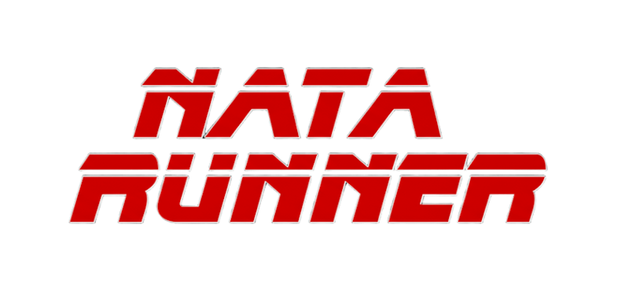
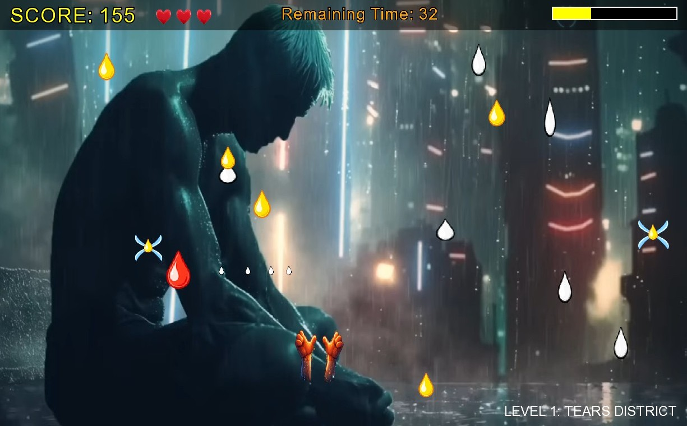
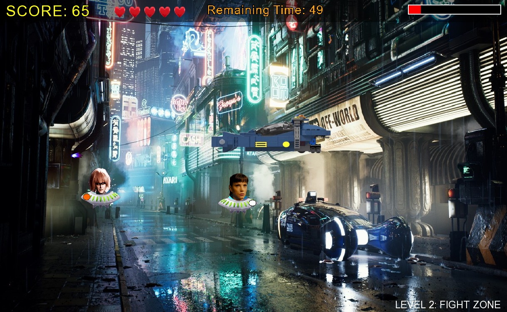
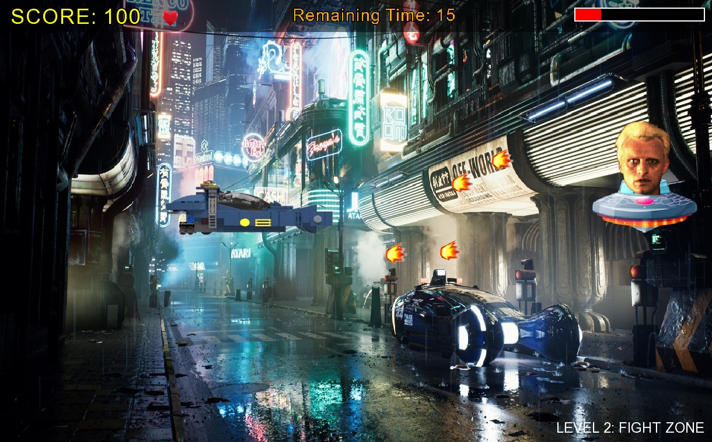
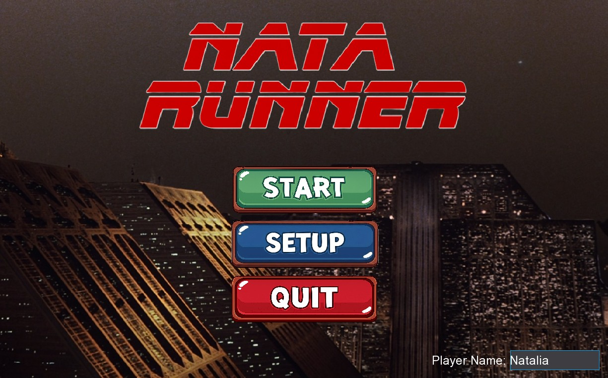
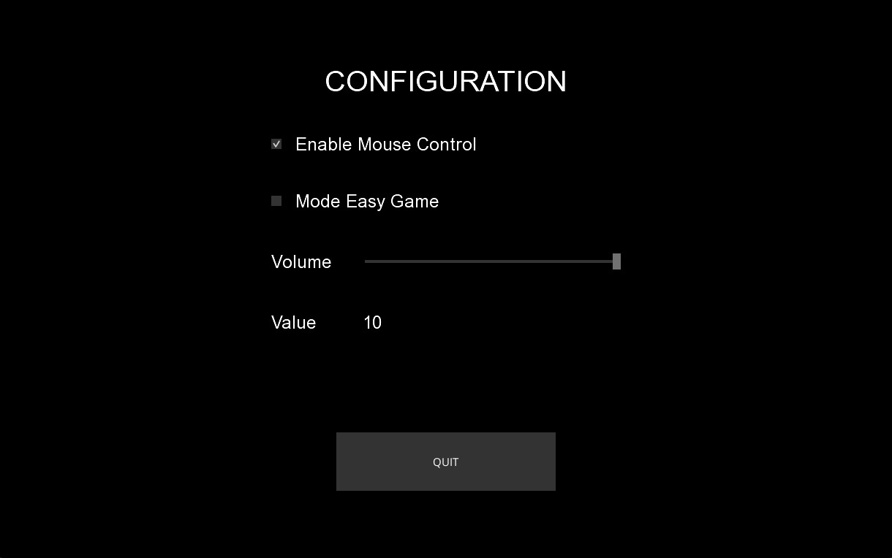
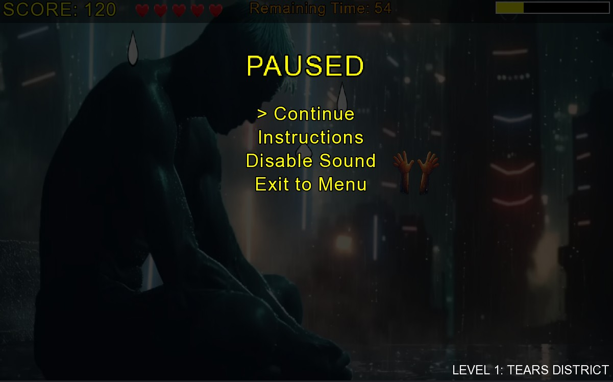
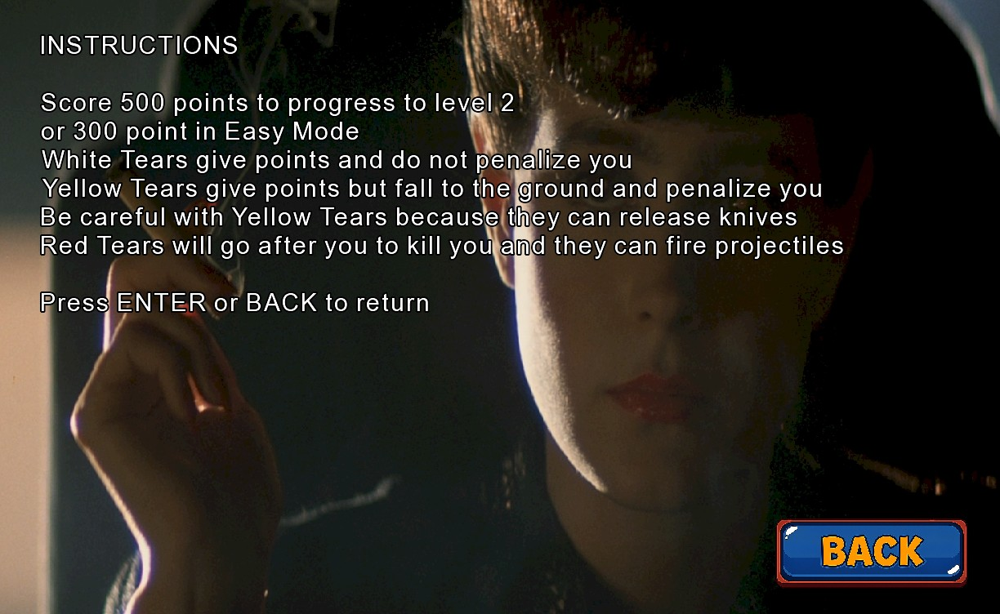
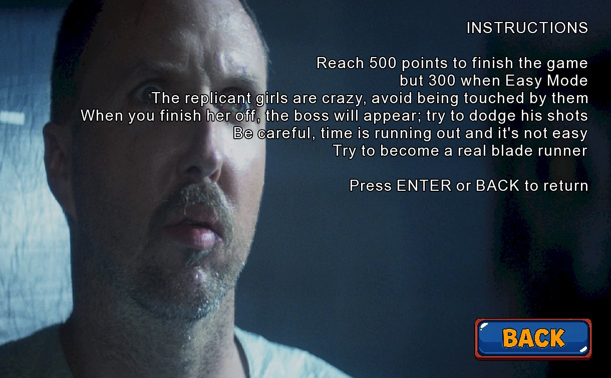
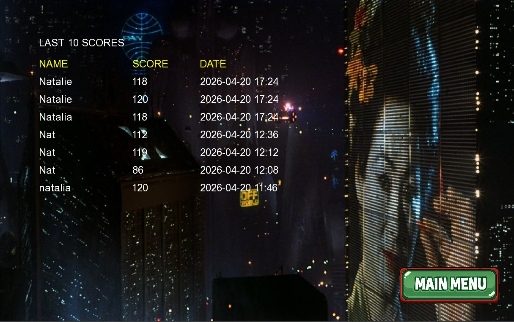

 

# Descripción
Juego de acción y plataformas 2D desarrollado en Java con el framework LibGDX. El juego rinde homenaje al universo cyberpunk de **Blade Runner**, sumergiendo al jugador en la atmósfera lluviosa y decadente de Los Ángeles 2019.

Acompaña al protagonista a través de una narrativa dividida en dos actos mecánicamente distintos:

## Nivel 1: "Tears District" 💧
Un nivel atmosférico basado en el clímax emocional de la película en la Roy dice la mítica frase de "todos esos momentos se perderán como lágrimas en la lluvia"
Para progresar al Nivel 2, deberás alcanzar la puntuación objetivo gestionando los distintos tipos de elementos:

- Lágrimas Blancas: Recógelas para sumar puntos sin riesgos (+ 10 pts).

- Lágrimas Amarillas: Dan puntos (+15 pts), pero penalizan si tocan el suelo (-25 pts). ¡Cuidado! Al caer pueden liberar cuchillos peligrosos que te quitarán una vida si los tocas (- ❤).

- Lágrimas Rojas: Enemigos hostiles que te perseguirán activamente y pueden disparar proyectiles para acabar contigo. No hay que recogerlas, si te tocan te restarán una vida (- ❤) y si te alcanzan sus balas te restarán puntos (-25 pts).

⌚ Tienes 1 minuto para completar el nivel o perderás una vida (- ❤).

🏆 ¿Cómo ganar? Atrapa lágrimas blancas y amarillas antes de que se acabe el tiempo para llenar tu barra de vida/puntos.

## Nivel 2: "Fight Zone" 💥
La confrontación final.  Aquí la agilidad es clave para sobrevivir al caos de la ciudad desde el Spinner.  El nivel se divide en 2 escenas:

- Escena 1: Evita a toda costa el contacto con las replicantes: su toque es dañino (- 25 pts).  Además, se lanzarán contra ti cuando menos te lo esperes.  Dispara contra ellas para eliminarlas (con un disparo es suficiente para acabar con una de ellas, y ganar puntos: +15 pts).

- Escena 2: Al eliminar a las replicantes 10 veces aparecerá Roy, el Boss.  Deberás esquivar sus disparos mientras intentas contraatacar.  Cada vez que uno de sus proyectiles te alcance te restará vida (-25 pts) y si, por algún fatídico error, chocas contra él, perderás vida (- 25 pts).
Para pasar este nivel completa tu barra de puntuación/vida disparando contra él, cada disparo que le alcance te otorgará puntos (+ 10 pts).

⌚ Nuevamente esta escena va contrarreloj.  No solo luchas contra enemigos, el tiempo se agota rápidamente.  Tienes 1 minuto para completar el nivel y no perder una vida.  Solo los mejores lo lograrán y se convertirán en un auténtico Blade Runner.

🏆 ¿Cómo ganar? Elimina 10 veces a las replicantes y consigue sobrevivir al Boss.  Cuando llenes tu barra de puntos/vida habrás ganado.

# Modo de juego, ajustes, controles y atajos 🎮
## Modo de juego y ajustes
Al inicio del juego aparecen tres botones:

- Pulsa `START` para comenzar la partida.
- Pulsa `SETUP` para configurar tu partida:
  - Habilitar/Deshabilitar control con ratón.
  - Habilitar/Deshabilitar modo fácil.  En el modo fácil cada nivel se completa con 300 puntos, en lugar de con 500.
  - Ajustar el volumen general del juego.

- Pulsa `QUIT` para salir del juego

Además, en cualquier momento de la partida pulsa `ESC` para abrir un menú de pausa:

Desde este menú podrás:

- Retomar la partida `Continue`
- Acceder a las instrucciones del nivel:

- Deshabilitar la música y los efectos de sonido `Disable/Enable Sound`
- Volver a la pantalla de título `Exit to Menu`

Además en el cuadro de texto de la esquina inferior derecha podrás introducir tu apodo para registrar tu puntuación final.

## Controles
### Nivel 1 - Tears District
⌨ Muévete con las flechas del teclado:
- Derecha: `→`
- Izquierda: `←`
- Arriba: `↑`
- Abajo: `↓`

🖱️ En caso de que hayas habilitado movimiento con ratón, también podrás moverte manteniendo clic izquierdo sobre el dibujo de las manos y deslizando en la dirección deseada.

### Nivel 2 - Fight Zone
⌨ Muévete con las flechas del teclado:
- Derecha: `→`
- Izquierda: `←`
- Arriba: `↑`
- Abajo: `↓`

Gira sobre ti mismo con `Ctrl` + flecha Izquierda o Derecha. 

🖱️ En caso de que hayas habilitado movimiento con ratón: 
- Clic izquierdo sobre el Spinner (tu vehículo volador) y desliza en la dirección deseada 
- Dispara con la barra espaciadora ** ␣ **
- Gira sobre ti mismo para apuntar pulsando la tecla `G`

## Atajos
- Deshabilita la música, pero no los efectos de sonido con `M`
- Congela la partida con `F`
- Completa el nivel con `L`
- Borra las puntuaciones guardadas con `F9` desde la pantalla inicial.

# Ranking de puntuaciones
En la pantalla final, tras superar los dos niveles podrás acceder a una tabla resumen con las 10 mejores puntuaciones con la fecha y la hora (ordenadas de más a menos recientes):

Únicamente se registran las 10 últimas partidas.  Es posible limpiar los registros de esta tabla pulsando ´F9´ desde la pantalla inicial, tal y como se explica en el apartado de Atajos.

La puntuación es el tiempo máximo entre los dos niveles 2 minutos (120 segundos) menos el tiempo invertido para superar el nivel.
Nota: cada vez que pierdes una vida este tiempo se resetea.

# Música 🎼
A continuación se listan los temas instrumentales utilizados por orden de aparición en el juego:

- Love Theme (From "Blade Runner") - Vangelis
- Tears in the Rain (From "Blade Runner 2049") Slowed Version
- Blade Runner (End Titles) - Vangelis
- Mesa - Hans Zimmer & Benjamin Wallfisch

# Imágenes 📸
Imágenes obtenidas de las películas de la franquicia de **Blade Runner**:
- Blade Runner (1982)
- Blade Runner 2049 (2017)

---
# Autora
**Natalia Garré Ramo**

Proyecto desarrollado para la 2ª Evaluación de la asignatura de Programación Multimedia del 2º curso de Desarrollo de Aplicaciones Multiplataforma · Curso 2025 - 2026

